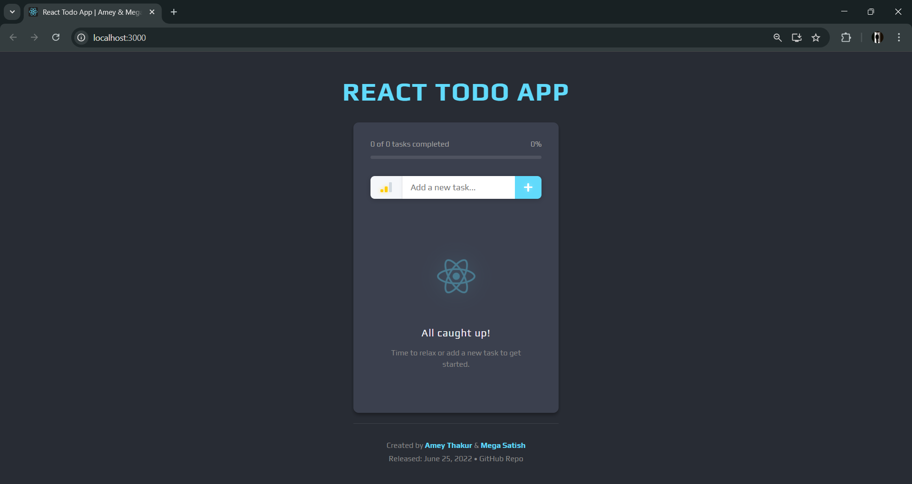
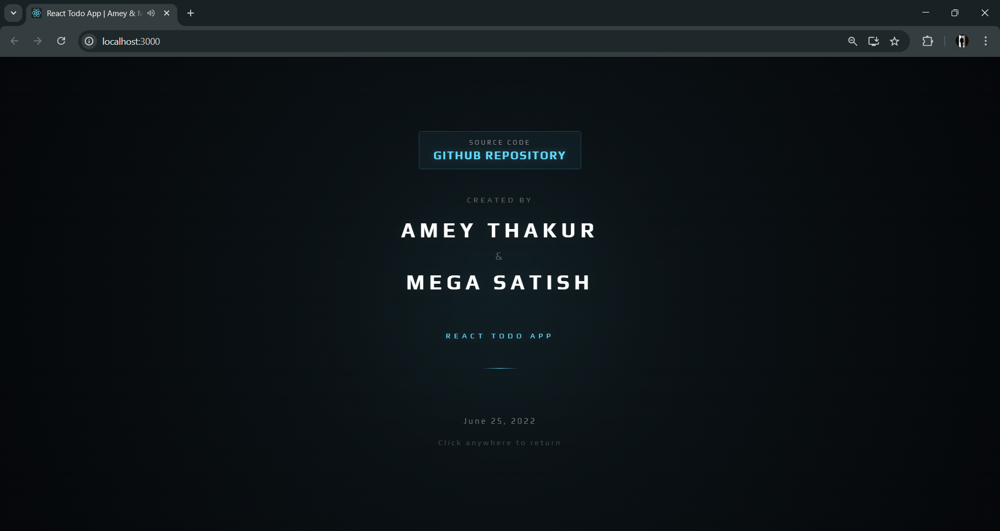
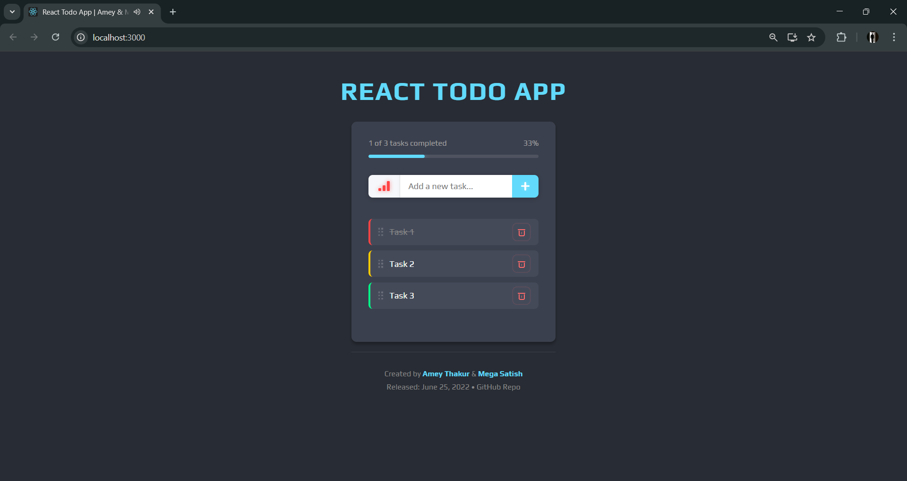
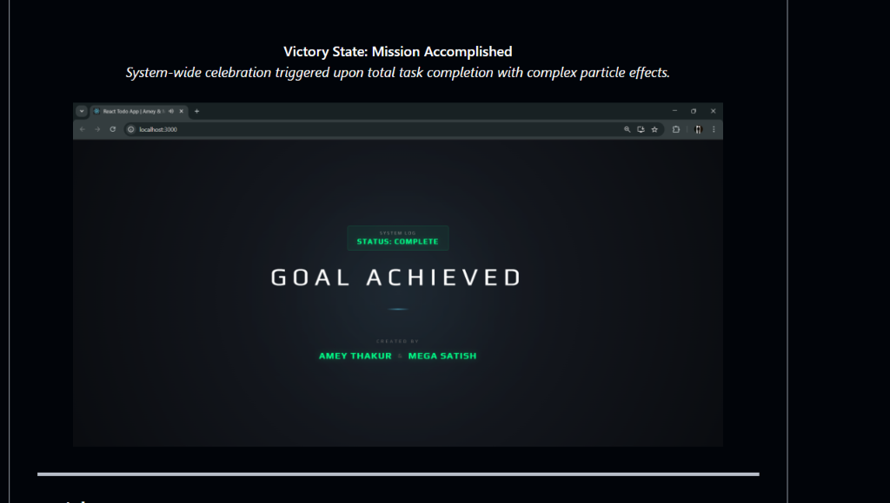

<div align="center">

  <a name="readme-top"></a>
  # React Todo App

  [](LICENSE)
  
  [](https://github.com/Amey-Thakur/REACT-TODO-APP)
  [](https://github.com/Amey-Thakur/REACT-TODO-APP)

  A high-performance, tactile task management system built with React and Framer Motion, utilizing procedural audio feedback for an enhanced Human-Machine Interaction (HMI) experience.

  **[Source Code](Source%20Code/)** &nbsp;·&nbsp; **[Technical Specification](docs/SPECIFICATION.md)** &nbsp;·&nbsp; **[Live Demo](https://amey-thakur.github.io/REACT-TODO-APP/)**

</div>

---

<div align="center">

  [Authors](#authors) &nbsp;·&nbsp; [Overview](#overview) &nbsp;·&nbsp; [Features](#features) &nbsp;·&nbsp; [Structure](#project-structure) &nbsp;·&nbsp; [Results](#results) &nbsp;·&nbsp; [Quick Start](#quick-start) &nbsp;·&nbsp; [Usage Guidelines](#usage-guidelines) &nbsp;·&nbsp; [License](#license) &nbsp;·&nbsp; [About](#about-this-repository) &nbsp;·&nbsp; [Acknowledgments](#acknowledgments)

</div>

---

<!-- AUTHORS -->
<div align="center">

  <a name="authors"></a>
  ## Authors

| <a href="https://github.com/Amey-Thakur"></a><br>[**Amey Thakur**](https://github.com/Amey-Thakur)<br><br>[](https://orcid.org/0000-0001-5644-1575) | <a href="https://github.com/msatmod"></a><br>[**Mega Satish**](https://github.com/msatmod)<br><br>[](https://orcid.org/0000-0002-1844-9557) |
| :---: | :---: |

</div>

> [!IMPORTANT]
> ### 🤝🏻 Special Acknowledgement
> *Special thanks to **[Mega Satish](https://github.com/msatmod)** for her meaningful contributions, guidance, and support that helped shape this work.*

---

<!-- OVERVIEW -->
<a name="overview"></a>
## Overview

**React Todo App** is a tactile interactive system engineered to redefine productivity through a responsive interface. By bridging the gap between traditional list-making and sensory-rich digital environments, this repository provides a foundational study into modern front-end architecture and Human-Machine Interaction (HMI).

The application serves as a digital exploration of state management and physics-based animations, brought into a modern context via Vite and React 19, enabling high-performance task orchestration directly within the browser environment.

### Productivity Heuristics
The interaction model is governed by strict **computational design patterns** ensuring fidelity and responsiveness:
*   **Kinetic Feedback**: The system utilizes **Framer Motion** for complex physics-based animations, providing tactile confirmation for every user action from task creation to reordering.
*   **Procedural Audio**: Beyond visual cues, the system integrates a **Web Audio API engine** that dynamically generates synthesized waveforms, reinforcing the goal-driven narrative of the application.
*   **State Persistence**: LocalStorage integration ensures the mission docket remains synchronized across session restarts, maintaining a zero-latency bridge between raw data and actionable progress.

> [!TIP]
> **Sensory Precision Integration**
>
> To maximize user engagement, the system employs a **multi-sensory validation system**. **Visual progress vectors** visualize the completion state, and **procedural chimes** provide auditory rewards, strictly coupling productivity goals with state changes. This ensures the user's mental model is constantly synchronized with the underlying mission trajectory.

---

<!-- FEATURES -->
<a name="features"></a>
## Features

| Feature | Description |
|---------|-------------|
| **Tactile Interaction** | Implements **Physics-Based Drag-and-Drop** for intuitive and high-impact task reordering. |
| **Procedural Audio** | Custom **Web Audio Synthesizer** generating real-time waveforms for tactile sensory feedback. |
| **Progress Persistence** | Robust **LocalStorage Sync** ensuring mission data survives browser lifecycle events. |
| **Cinematic Loading** | A deterministic **System Boot Sequence** that ensures assets are synchronized before interaction. |
| **Dynamic Priority** | Integrated **Tri-State Priority Engine** for visual and structural task classification. |
| **Victory Shimmer** | **High-Fidelity Particle Systems** and shockwaves that celebrate mission completion milestones. |
| **PWA Readiness** | **Service Worker Integration** allowing for offline task tracking and standalone installation. |
| **Structural Clarity** | In-depth and detailed comments integrated throughout the codebase for transparent logic study. |

> [!NOTE]
> ### Interactive Polish: The Neural Slate
> We have engineered a **Logic-Driven Animation Manager** that calibrates layout shifts across multiple vectors to simulate fluid human-like movement. The visual language focuses on the minimalist "Neural Slate" aesthetic, ensuring maximum focus on the interactive mission trajectory.

### Tech Stack
- **Languages**: JavaScript (React 19)
- **Logic**: **State Orchestration** (React Hooks & Contextual Persistence)
- **Motion**: **Framer Motion** (Physics-Based Dynamics)
- **Audio**: **Web Audio API** (Procedural Synthesis)
- **UI System**: Modern Design (Custom CSS & Glassmorphism)
- **Tooling**: Vite 6 (Modern Bundling Architecture)
- **Deployment**: GitHub Actions (PWA Deployment Pipeline)
- **Hosting**: GitHub Pages

---

<!-- STRUCTURE -->
<a name="project-structure"></a>
## Project Structure

```python
REACT-TODO-APP/
│
├── .github/ workflows/              # CI/CD Automation
│   └── deploy.yml                   # GitHub Pages Deployment
│
├── docs/                            # Project Documentation
│   └── SPECIFICATION.md             # Technical Architecture
│
├── Mega/                            # Attribution Assets
│   ├── Filly.jpg                    # Companion (Filly)
│   └── Mega.png                     # Profile Image (Mega Satish)
│
├── screenshots/                     # Visual Gallery
│   ├── 1_Landing_Page.png           # Modern Interface
│   ├── 2_Title_Animation.png        # Interactive Feedback
│   ├── 3_Tasks_Added.png            # State Management
│   ├── 4_Progress_33.png            # Progress Tracking
│   └── 8_Victory_Mission.png        # Victory State
│
├── Source Code/                     # Primary Application Layer
│   ├── public/                      # Static Assets
│   ├── src/                         # React Components
│   │   ├── SoundEngine.js           # Audio Synthesis Core
│   │   ├── TodoApp.jsx              # Main Orchestration
│   │   └── index.jsx                # Entry Point
│   ├── vite.config.js               # Build Architecture
│   └── package.json                 # Dependency Manifest
│
├── SECURITY.md                      # Security Protocols
├── CITATION.cff                     # Project Citation Manifest
├── codemeta.json                    # Metadata Standard
├── LICENSE                          # MIT License
└── README.md                        # Project Entrance
```

---

<a name="results"></a>
## Results

<div align="center">
  <b>Main Interface: Modern Design</b>
  <br>
  <i>Initial system state with optimized aesthetics and synchronized brand identity.</i>
  <br><br>
  
  <br><br><br>

  <b>Mission Injection: Interactive Input</b>
  <br>
  <i>Real-time task injection into the reactive orchestration corridor.</i>
  <br><br>
  
  <br><br><br>

  <b>Tactile Feedback: Kinetic Interaction</b>
  <br>
  <i>Successful interaction states with high-fidelity visual and auditory feedback.</i>
  <br><br>
  
  <br><br><br>

  <b>Quantified Progress: Milestone Tracking</b>
  <br>
  <i>Operational and visual progress indicators for real-time mission synchronization.</i>
  <br><br>
  
  <br><br><br>

  <b>Victory State: Mission Accomplished</b>
  <br>
  <i>System-wide celebration triggered upon total task completion with complex particle effects.</i>
  <br><br>
  
</div>

---

<!-- QUICK START -->
<a name="quick-start"></a>
## Quick Start

### 1. Prerequisites
- **Node.js 18+**: Required for build and runtime execution. [Download Node.js](https://nodejs.org/)
- **npm**: Usually bundled with Node.js.
- **Git**: For version control and cloning. [Download Git](https://git-scm.com/downloads)

> [!WARNING]
> **Persistence Asset Acquisition**
>
> The application utilizes browser LocalStorage for mission persistence. If running in "Incognito" or "Private" mode, state synchronization may be restricted, preventing the mission docket from persisting across browser lifecycle events.

### 2. Installation & Setup

#### Step 1: Clone the Repository
Open your terminal and clone the repository:
```bash
git clone https://github.com/Amey-Thakur/REACT-TODO-APP.git
cd REACT-TODO-APP
```

#### Step 2: Navigate to Source
Access the primary application layer:
```bash
cd "Source Code"
```

#### Step 3: Install Core Dependencies
Synchronize the local environment with the mission requirements:
```bash
npm install
```

### 3. Execution
Launch the primary reactive development server:

```bash
npm run dev
```

---

<!-- USAGE GUIDELINES -->
<a name="usage-guidelines"></a>
## Usage Guidelines

This repository is openly shared to support learning and knowledge exchange across the engineering community.

**For Students**  
Use this project as reference material for understanding **React State Management (Hooks)**, **Physics-Based UI Animations (Framer Motion)**, and **procedural audio synthesis**. The source code is available for study to facilitate self-paced learning and exploration of **modern front-end pipelines and HMI design principles**.

**For Educators**  
This project may serve as a practical lab example or supplementary teaching resource for **Web Engineering**, **Human-Machine Interaction**, and **Interactive System Architecture** courses. Attribution is appreciated when utilizing content.

**For Researchers**  
The documentation and architectural approach may provide insights into **systematic project structuring**, **Vite-based PWA deployment**, and **sensory feedback loops in interactive software**.

---

<!-- LICENSE -->
<a name="license"></a>
## License

This repository and all its creative and technical assets are made available under the **MIT License**. See the [LICENSE](LICENSE) file for complete terms.

> [!NOTE]
> **Summary**: You are free to share and adapt this content for any purpose, even commercially, as long as you provide appropriate attribution to the original authors.

Copyright © 2021 Amey Thakur & Mega Satish

---

<!-- ABOUT -->
<a name="about-this-repository"></a>
## About This Repository

**Created & Maintained by**: [Amey Thakur](https://github.com/Amey-Thakur) & [Mega Satish](https://github.com/msatmod)

This project features **React Todo App**, a sensory-rich task management system. It represents a personal exploration into **React**-based state orchestration and high-performance interactive design via **Framer Motion**.

**Connect:** [GitHub](https://github.com/Amey-Thakur) &nbsp;·&nbsp; [LinkedIn](https://www.linkedin.com/in/amey-thakur) &nbsp;·&nbsp; [ORCID](https://orcid.org/0000-0001-5644-1575)

### Acknowledgments

Grateful acknowledgment to [**Mega Satish**](https://github.com/msatmod) for her exceptional collaboration and partnership during the development of this interactive engineering project. Her constant support, technical clarity, and dedication to software quality were instrumental in achieving the system's functional objectives. Learning alongside her was a transformative experience; her thoughtful approach to problem-solving and steady encouragement turned complex requirements into meaningful learning moments. This work reflects the growth and insights gained from our side-by-side journey. Thank you, Mega, for everything you shared and taught along the way.

Special thanks to the **mentors and peers** whose encouragement, discussions, and support contributed meaningfully to this learning experience.

---

<div align="center">

  [↑ Back to Top](#readme-top)

  [Authors](#authors) &nbsp;·&nbsp; [Overview](#overview) &nbsp;·&nbsp; [Features](#features) &nbsp;·&nbsp; [Structure](#project-structure) &nbsp;·&nbsp; [Results](#results) &nbsp;·&nbsp; [Quick Start](#quick-start) &nbsp;·&nbsp; [Usage Guidelines](#usage-guidelines) &nbsp;·&nbsp; [License](#license) &nbsp;·&nbsp; [About](#about-this-repository) &nbsp;·&nbsp; [Acknowledgments](#acknowledgments)

  <br>

  🧠 **[React Todo App](https://amey-thakur.github.io/REACT-TODO-APP)**

  ---

  ### 🎓 [Computer Engineering Repository](https://github.com/Amey-Thakur/COMPUTER-ENGINEERING)

  **Computer Engineering (B.E.) - University of Mumbai**

  *Semester-wise curriculum, laboratories, projects, and academic notes.*

</div>
