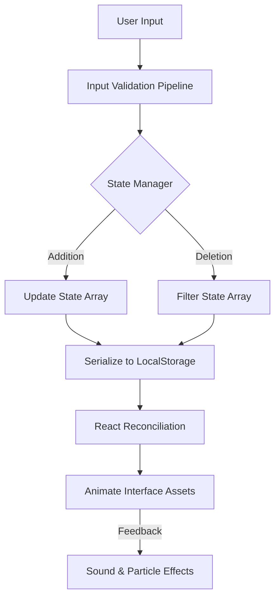

# Technical Specification: React Todo App

## Architectural Overview

**React Todo App** is a high-performance Task Management architecture designed to organize and persist user activities utilizing component-based state logic and kinetic UI interactions. The application serves as a digital study into React hooks, state preservation, and advanced animation orchestration, brought into a modern context via Framer Motion and Local Storage.

### Data Logic Flow

---

## Technical Implementations

### 1. Component Architecture
-   **Core Interface**: Built on **React 18** and **JSX**, enabling the execution of component-based UI logic natively within the DOM environment.
-   **State Topology**: Implements a centralized state hook architecture (`useState`, `useEffect`) for synchronous data management across the component tree.

### 2. Logic & Animations
-   **Kinetic Interaction**: Uses physics-based animation libraries via **Framer Motion** to perform real-time layout transitions and presence detection.
-   **Sound Engineering**: Provides a multi-sensory feedback loop using modular audio assets to reinforce user actions (completion, deletion, error).
-   **Persistence Pipeline**: Event-driven synchronization with the `localStorage` API to ensure data durability across session lifecycles.

### 3. Deployment Pipeline
-   **Build Process**: The project uses **React Scripts** to compile and bundle the application, optimizing assets for production deployment without manual configuration.
-   **CI/CD**: **GitHub Actions** handles the deployment process, syncing static assets, styles, and scripts to **GitHub Pages**.

---

## Technical Prerequisites

-   **Runtime**: Modern ES6+ compliant browser (Chrome, Edge, Firefox).
-   **Development**: Node.js 14+ with `npm` or `yarn` installed.

---

*Technical Specification | React | Version 1.0*
